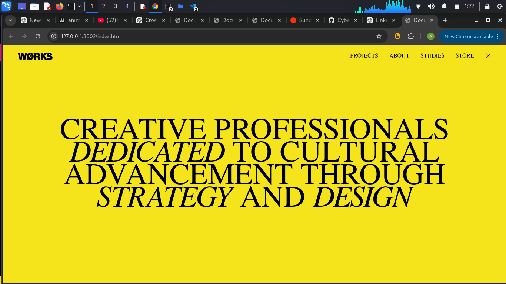
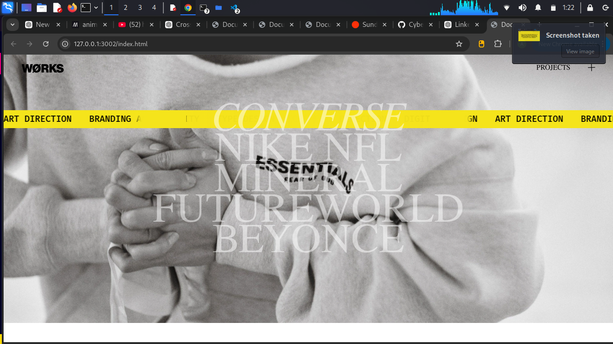
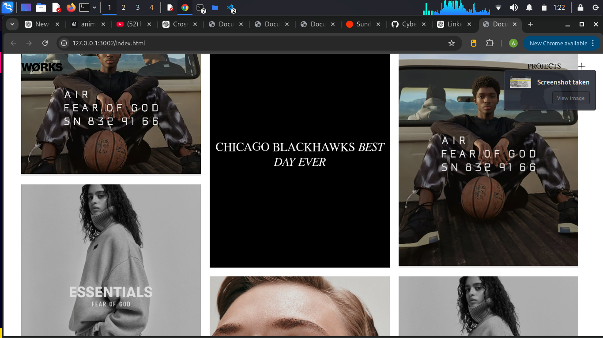
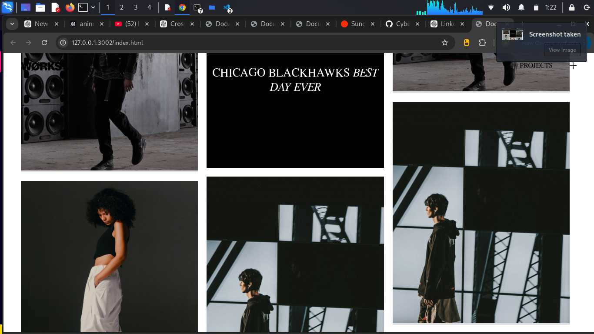
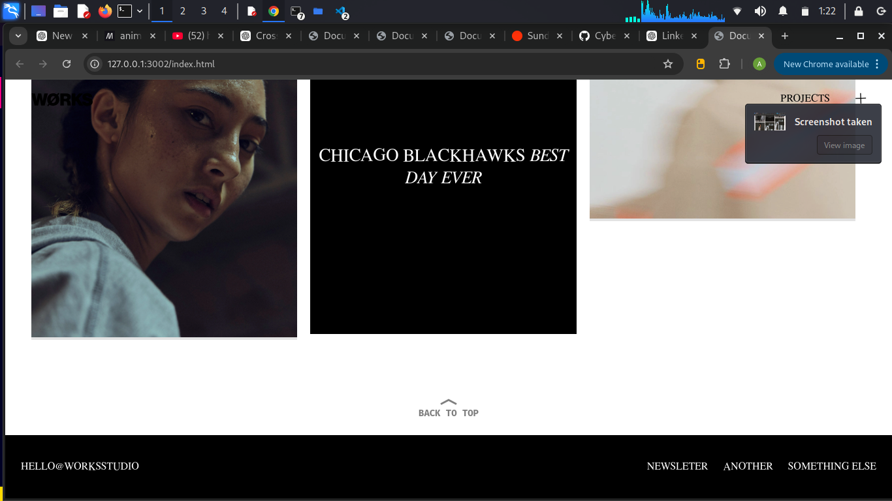

# Animated Landing Page

A modern animated landing page built using **HTML, CSS, JavaScript**, with smooth scrolling and interactive animations.

## Features

- Smooth scroll animations powered by **Locomotive.js**
- High-performance timeline animations using **GSAP**
- Interactive hover effects and responsive design
- Clean and structured code for easy customization

## Demo

Here are some screenshots of the animated landing page:








## Technologies Used

- HTML5
- CSS3
- JavaScript (ES6+)
- [GSAP](https://greensock.com/gsap/) – for animations
- [Locomotive.js](https://locomotive.ca/) – for smooth scrolling

## Installation

1. Clone this repository:
   ```bash
   git clone https://github.com/CyberWarrior1001/Work-Studio-Animated-Landing-Page.git
   ```
